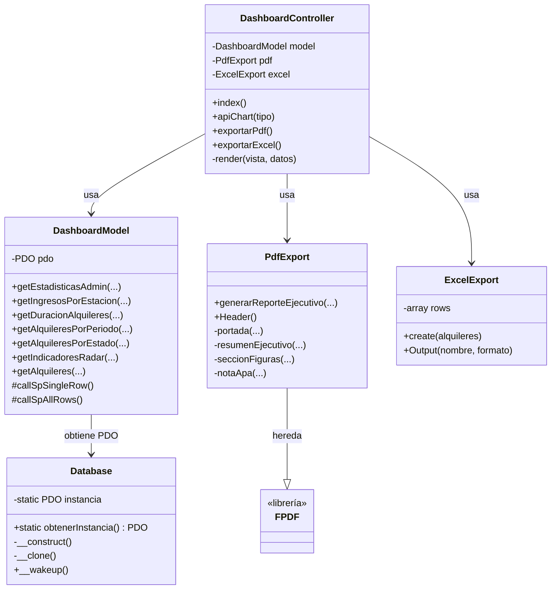

# C4 — Diagrama de código

Clases principales del sistema y sus relaciones.

```mermaid
classDiagram
    class Database {
        -static PDO instancia
        +static obtenerInstancia() PDO
        -__construct()
        -__clone()
        +__wakeup()
    }
    class DashboardModel {
        -PDO pdo
        +getEstadisticasAdmin(...)
        +getIngresosPorEstacion(...)
        +getDuracionAlquileres(...)
        +getAlquileresPorPeriodo(...)
        +getAlquileresPorEstado(...)
        +getIndicadoresRadar(...)
        +getAlquileres(...)
        #callSpSingleRow()
        #callSpAllRows()
    }
    class DashboardController {
        -DashboardModel model
        -PdfExport pdf
        -ExcelExport excel
        +index()
        +apiChart(tipo)
        +exportarPdf()
        +exportarExcel()
        -render(vista, datos)
    }
    class PdfExport {
        +generarReporteEjecutivo(...)
        +Header()
        -portada(...)
        -resumenEjecutivo(...)
        -seccionFiguras(...)
        -notaApa(...)
    }
    class ExcelExport {
        -array rows
        +create(alquileres)
        +Output(nombre, formato)
    }
    class FPDF {
        <<librería>>
    }

    DashboardController --> DashboardModel : usa
    DashboardController --> PdfExport : usa
    DashboardController --> ExcelExport : usa
    DashboardModel --> Database : obtiene PDO
    PdfExport --|> FPDF : hereda
```
